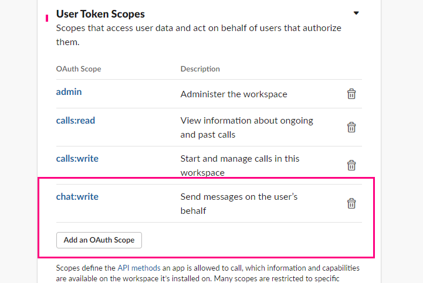

# slack_app_tutorial

## 미리 설치해야 되는 것들
- npm
- ngrok
- flask
- slacker
- slack-client

## 설치

- npm 설치
- ngrok 설치
- flask 설치
- slacker 설치

- slack-client 설치
```
pip install slackclient
```


## 사용방법


- 복잡하니 나중에 자세히 적자
- 우선은 api.slack.com 인가 거기서 app 만들고 권한주고 
- 통신할 수 있게 flask 서버 열고 거기에다가 @app.route("경로") 써서 명령 받을 수 있게 하고 
- ngrok http 8080 해서 slack에서 내 컴퓨터로 접속할 수 있게 주소를 뚫는다.
- 대충 뭐 그런방식으로 설계하고 하면된다. 


## 이제 어떻게 할꺼야?

- 고작 이거한다고 서버 해달라고 할 수 없으니 AWS에서 제공하는 공짜 서버를 쓸수는 없을까?
- google은 공짜 서버 안주나?
- 알아봐야지

## Error가 나면?

slack-client로 갈아타야될거 같은게...

slacker는 error를 너무 대충 알려줘...

slack-client는 뭐가 문제인지도 알려줌

postMessage 실행했는데 계속 안됬는데 보니까

### slacker Error 모습
```
slacker.Error: missing_scope
```

### slack-client Error 표시 모습
```
slack.errors.SlackApiError: The request to the Slack API failed.
The server responded with: {'ok': False, 'error': 'missing_scope', 'needed': 'chat:write:bot', 'provided': 'admin,identify,calls:write,calls:read'}
```

### 아래 사진에 있는 chat:write 를 User Token Scopes에 추가해줘야 가능함



## Redmine과 연결하는 방법?

외부에서 접속하게 하기 위해서

ngrok으로 서버를 두개 열어야됨

하나는 slack과 연결하기 위한 것

하나는 Redmine에 접속할 수 있게 하기 위한 것!

Redmine은 기본적으로 80번 port로 열려 있음

따라서 

```
ngrok http 80 
```

으로 열여줘야함

