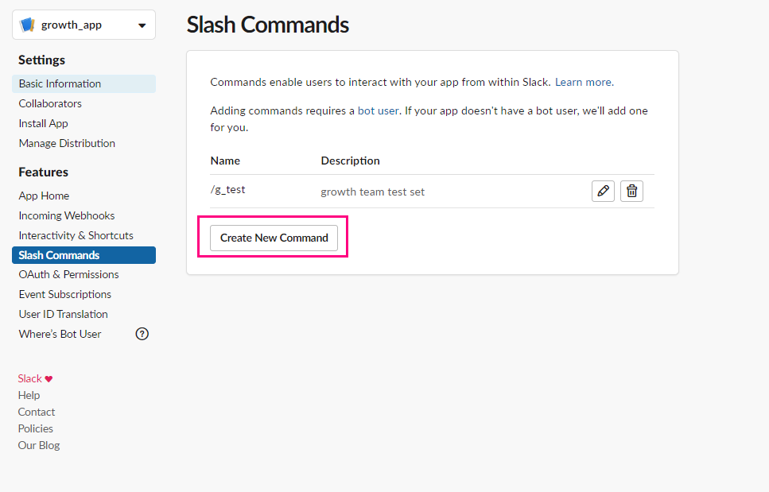

# slack_app_tutorial

## 안되거나 막히는 내용이 있으면 그냥 바로 연락주세요!


## 미리 설치해야 되는 것들
- node.js
- ngrok
- flask
- ~~slacker~~
- slack-client

## 설치

- [node.js 설치](https://nodejs.org/ko/)

- ngrok 설치
```
npm install ngrok -g
```

- flask 설치
```
pip install flask
```

- ~~slacker 설치~~
```
#불필요한 설치 
pip install slacker
```

- slack-client 설치
```
pip install slackclient
```

## 필요한것

서버....


## 사용방법


- 우선은 [api.slack.com](https://api.slack.com/)에서 app 만들고 권한주기
    - 필요한 권한들 선택해서 줘야한다.
    
    - 지금은 되는대로 다 주고 해봤는데 slack-client library를 사용하면 권한 설정 안했을때 어떤 권한이 필요한지 알려주기 때문에 최소 권한만 주고 수행해서 필요한 권한을 찾아서 추가하면 좋을것 같다. 


- 통신할 수 있게 flask 서버 열고 거기에 @app.route("경로") 써서 명령 받을 수 있게 하기
- ~~ngrok http 8080 해서 slack에서 내 컴퓨터로 접속할 수 있게 주소를 뚫는다.~~
- server를 열어서 http 혹은 https로 접속할 수 있도록 한다.

## 설정관련 사진

### 설정 페이지


### Slash Commands
Slash Commands는 slack에서 어떤 /명령 을 사용하면 동작하게 할것이고 그것의 결과를 어디로 보낼것인지 설정하는 곳입니다. 

```python
@app.route("/slack/project", methods=["GET", "POST"])
```

main.py에는 위와 같이 **/slack/project**로 해두었는데 저건 맘대로 설정하셔도 됩니다. 




### Interactive Components

Interactive Components는 slack과 상호 동작해야 하는 경우  
어떤 통로로 데이터를 주고 받을 것인지 결정하는 곳인데 main.py 코드에 보시면

```python
@app.route("/slack/interaction", methods=["GET", "POST"])
```

위 부분에 있는 내용을 설정하는 곳이라고 보시면 됩니다.  
slash command를 통해서 dialog를 띄우도록 코드가 작성되어 있는데  

dialog에서 send btn을 누르고 나서   
그 결과를 어디로 받을건지를 설정하는 곳이라고 보시면 됩니다.


### 권한 내역


불 필요한 권한들은 지우고 사용하면 됩니다.


## Error가 나면?

slacker는 error를 너무 대충 알려줌

slack-client는 뭐가 문제인지도 알려줌

### slacker Error 모습
```
slacker.Error: missing_scope
```

### slack-client Error 표시 모습
```
slack.errors.SlackApiError: The request to the Slack API failed.
The server responded with: {'ok': False, 'error': 'missing_scope', 'needed': 'chat:write:bot', 'provided': 'admin,identify,calls:write,calls:read'}
```

### 위 에러를 확인하고 아래 사진에 있는 chat:write를 User Token Scopes에 추가해서 해결


## dialog와 modals의 사용에 관해서....

modal의 표현 방식이 dialog보다 직관적이지 않고 오히려 더 어렵다.

지금 만들어 놓은게 dialog 여서 인게 아니라 정말 넘어오는 데이터가 잘 정리 되어 있는것 같지는 않다. 

필요한 기존에 dialog는 channel에 대한 정보를 포함하여 json형태로 parsing해줬는데  

modal은 parsing해주는 정보를 보면 channel 정보가 사라지고 더 복잡한 형태의 데이터가 넘어온다.   

dialog를 계속 쓸 수 있을지는 모르겠지만  
만든다면 그냥 dialog를 쓰는게 좋을 것 같다는 생각이 계속 든다. 

쓰는 방법을 정리해보자.

### dialog 사용방식


```python
#dialog 사용방식
open_dialog=slack_client.dialog_open(dialog=dialog,trigger_id=slack_event["trigger_id"])
```

### modal 사용방식

modal은 정말 이상한게 쓰는걸 보면 modal이라고 이름 지어 놓고 열때는 view_open 이라는걸 사용해서 열도록 해놓았다.

이게 좀 웃긴게 modal flow를 설명한 [link](https://api.slack.com/surfaces/modals/using)를 보면
views를 열고  
views를 update하고  
view를 push하고  
끝낸다는 뭔가 ... 복잡한 구조인데 

확실히 잘 모르겠다 


```python
open_modal = slack_client.views_open(trigger_id=slack_event["trigger_id"],view=my_modals)
```
---

